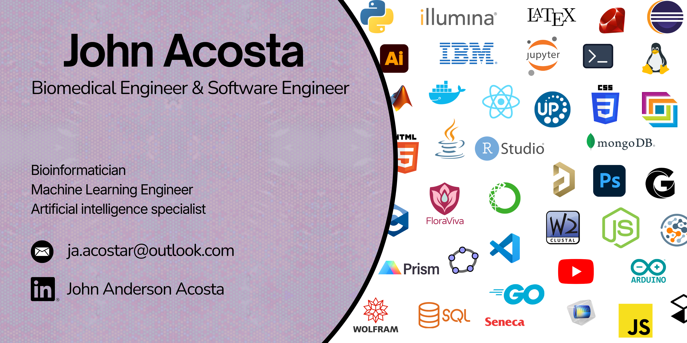

<h1 align="center">
    
</h1>

     

I'm a biomedical engineering student. I'm dedicated to enhancing my skills and contributing to improve the world of technology, healthcare and Global health innovation. Besides, i´ve solid knowledge with a strong focus on software development, computer vision, biomedical data analysis, and intelligent systems. Experienced in applying computational methods, machine learning, and image analysis to real-world biomedical and clinical challenges. Also, my training in computational mathematics, machine learning, and bioinformatics has provided a solid foundation for building scalable, data-driven solutions in healthcare and research environments.

## Education
- **Universidad de los Andes**, Bogotá, Colombia  
  -B.Sc. in Biomedical Engineering** (Aug 2022 – Present)
  
  *Minors
  
    - Biology  
    - Bioinformatics  
    - Machine Learning  
    - Computational Mathematics

## Professional Experience
- **Universidad de los Andes**, Bogotá, Colombia  
  **Teaching Assistant – Intro to Programming** (Jan 2024 – Jun 2024)  
  - Reviewed and debugged student code  
  - Designed supplementary Python programming exercises  
  - Provided structured feedback on programming assignments  

- **Universidad de los Andes**, Bogotá, Colombia  
  **Teaching Assistant – Precalculus** (Jun 2024 – Dec 2024)  
  - Supported lectures and academic activities  
  - Graded written assignments and evaluations  
  - Assisted students in mathematical problem-solving and analysis  

- **Universidad de los Andes**, Bogotá, Colombia  
  **Teaching Assistant – Cellular Biology** (Jun 2024 – Dec 2024; Jun 2025 – Dec 2025)  
  - Prepared and graded quizzes, workshops, and evaluations  
  - Guided students during laboratory sessions and office hours  
  - Reinforced theoretical and practical concepts in cellular biology  

- **Universidad de los Andes**, Bogotá, Colombia  
  **Teaching Assistant – Principles of Genetics and Evolution** (Jun 2025 – Dec 2025)  
  - Prepared and graded assignments on population genetics and molecular evolution  
  - Facilitated group discussions on evolutionary biology case studies  
  - Guided practical exercises on genetic analysis  

## Skills

- **Languages**: Spanish (Native), English (C1), Portuguese (B1).
- **Programming Languages**: Python, Java, JavaScript, C, HTML/CSS, R, Linux, SQL/NoSQL, NodeJS, GO
- **Development Tools**: VS Code, Eclipse, Jupyter Notebook, COMSOL Multiphysics, Jalview, STAR-CCM+, ClustalW, Docker

## Certifications & Achievements

- First Place, GSL Classroom — Tecnológico de Monterrey & Universidad de los Andes  
- Poster Presentation, Biomedical Engineering Research Symposium — Universidad de los Andes  
- Health Project Design and Management — Universidad Nacional de Colombia  
- Leadership (Level III) — Facultad de Medicina, Universidad Nacional de Colombia  
- Fundamentals of Probability and Applications — Universidad de los Andes  
- Contemporary Computer Vision Course — Universidad de los Andes  
- Contemporary Deep Learning Course — Universidad de los Andes  
- Advanced Python Course — Universidad de los Andes  
- **FloraViva – Biomedical Innovation Project**  
  - Conceived and validated a biomedical solution addressing unmet needs in vulvar health using a user-centered innovation framework  
  - Selected and awarded in **Jump Chile** by the **Dirección de Transferencia y Desarrollo, Pontificia Universidad Católica de Chile**, [recognizing its potential for technology transfer and real-world impact](https://www.linkedin.com/feed/update/urn:li:activity:7398335970124779520/)  
  - Presented during **Innovation Week at Universidad de los Andes**, [showcasing the technological concept, design iterations, and validation strategy to interdisciplinary audiences](https://www.linkedin.com/posts/andr%C3%A9s-felipe-toro-sosa-_innovaciaejn-academia-cienciaconpropaejsito-activity-7394397405279952896-uBmS?utm_source=share&utm_medium=member_desktop&rcm=ACoAAE3i0fIB9tauBjE_RhpAv6usJS97YHirzCw)  

## Projects

For a detailed list of my projects and contributions, please visit my [GitHub profile](https://github.com/johnacostar).

## Connect with me:

- 📞 Phone: (+57) 3123276656
- 📧 Email: ja.acostar1@outlook.com
- 🔗 LinkedIn: [(https://linkedin.com/in/aarevalom)](https://www.linkedin.com/in/john-acosta-ibio/)
- 🐙 GitHub: [github.com/johnacostar](https://github.com/johnacostar)
- 🌐 Portfolio: 
